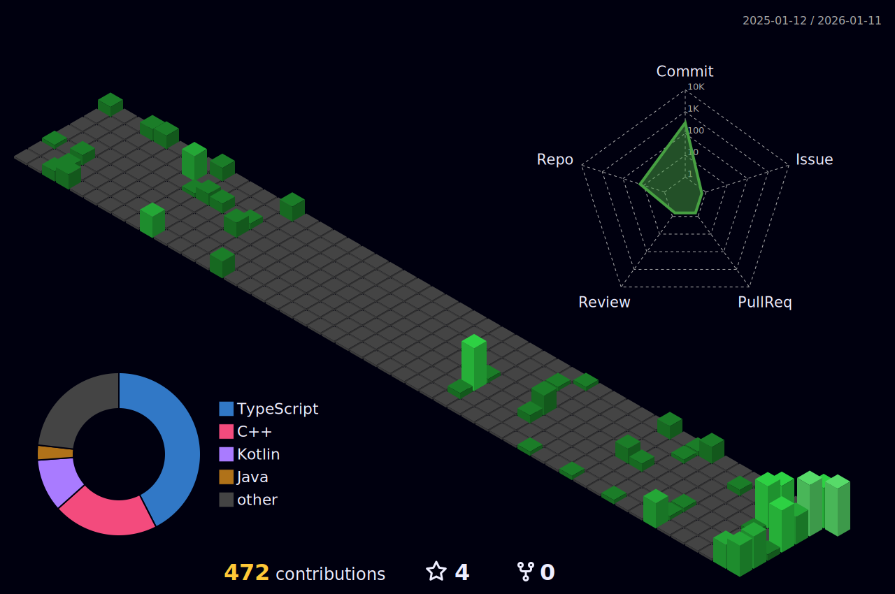

<picture>
  <source media="(prefers-color-scheme: dark)" srcset="https://capsule-render.vercel.app/api?type=slice&color=C0C0C0&height=120&section=header&fontSize=0" />
  <source media="(prefers-color-scheme: light)" srcset="https://capsule-render.vercel.app/api?type=slice&color=252525&height=120&section=header&fontSize=0" />
  
</picture>

  <h1 style="font-size: 5rem; font-weight: bold; margin-bottom: 0;">SHAIKH MAHAD</h1>

  <a href="https://git.io/typing-svg">
    <picture>
      <source media="(prefers-color-scheme: light)" srcset="https://readme-typing-svg.herokuapp.com?font=Fira+Code&weight=600&size=35&pause=1000&color=000000&center=true&vCenter=true&width=1000&lines=Backend+Systems+Engineer+(Java+%2F+Spring+Boot);Native+Android+Developer+(Kotlin+%2F+Compose);Data+Structures+%26+Algorithms+Enthusiast;Founder+%40+The+UBIT+Hub" />
      <source media="(prefers-color-scheme: dark)" srcset="https://readme-typing-svg.herokuapp.com?font=Fira+Code&weight=600&size=35&pause=1000&color=E0E0E0&center=true&vCenter=true&width=1000&lines=Backend+Systems+Engineer+(Java+%2F+Spring+Boot);Native+Android+Developer+(Kotlin+%2F+Compose);Data+Structures+%26+Algorithms+Enthusiast;Founder+%40+The+UBIT+Hub" />
      
    </picture>
  </a>

 

 
<h2 align="center">About Me</h2>

I am a Software Engineering undergraduate at UBIT (University of Karachi) with a strong bias toward <b>backend systems, correctness, and performance</b>.
  
I enjoy working close to fundamentals — data structures, object-oriented design, and system internals — and I care deeply about <i>why</i> a system is built a certain way, not just <i>how</i> it works.
  
Earlier, I worked extensively on <b>Native Android development (Kotlin / Jetpack Compose)</b>. Today, I am channeling that experience into <b>backend engineering with Java and Spring Boot</b>, building clean, scalable, production-grade services.
  
Outside of coursework, I founded <b>The UBIT Hub</b>, where I organize and mentor students around structured learning and engineering discipline.

 

 
<h2 align="center">Engineering Stack</h2>

<table align="center" style="border: none;">
  <tr>
    <td align="center" width="96">
      
       Java
    </td>
    <td align="center" width="96">
      
       Spring Boot
    </td>
    <td align="center" width="96">
      
       PostgreSQL
    </td>
    <td align="center" width="96">
      
       C++ (DSA)
    </td>
    <td align="center" width="96">
      
       Git
    </td>
  </tr>
  <tr>
    <td align="center" width="96">
      
       Kotlin
    </td>
    <td align="center" width="96">
      
       Android
    </td>
    <td align="center" width="96">
      
       Python
    </td>
     <td align="center" width="96">
      
       Postman
    </td>
    <td align="center" width="96">
      
       IntelliJ
    </td>
  </tr>
</table>

 

 
<h2 align="center">Technical Focus & Advanced Goals</h2>

  <ul align="left" style="display: inline-block;">
    <li><b>System Internals:</b> Deepening understanding of JVM architecture, Concurrency, and Memory Management.</li>
    <li><b>Backend Architecture:</b> Designing scalable REST APIs with Spring Boot (Security, Validation, Caching).</li>
    <li><b>Database Engineering:</b> Advanced PostgreSQL (Indexing, Query Optimization, and Schema Design).</li>
    <li><b>Algorithmic Problem Solving:</b> Consistent grinding on LeetCode/CodeForces to sharpen logic.</li>
  </ul>

 

 
<h2 align="center">Global Engineering Metrics</h2>
 

  <picture>
    <source media="(prefers-color-scheme: dark)" srcset="./profile-3d-contrib/profile-night-green.svg" />
    <source media="(prefers-color-scheme: light)" srcset="./profile-3d-contrib/profile-green-animate.svg" />
    
  </picture>

 

  <picture>
    <source media="(prefers-color-scheme: dark)" srcset="https://raw.githubusercontent.com/mahad2006/mahad2006/output/github-snake-dark.svg" />
    <source media="(prefers-color-scheme: light)" srcset="https://raw.githubusercontent.com/mahad2006/mahad2006/output/github-snake.svg" />
    
  </picture>

 

  <picture>
    <source media="(prefers-color-scheme: light)" srcset="https://github-readme-stats.vercel.app/api?username=mahad2006&show_icons=true&count_private=true&bg_color=ffffff&title_color=000000&text_color=4b5563&icon_color=374151&hide_border=true" />
    <source media="(prefers-color-scheme: dark)" srcset="https://github-readme-stats.vercel.app/api?username=mahad2006&show_icons=true&count_private=true&bg_color=0D1117&title_color=ffffff&text_color=9ca3af&icon_color=d1d5db&hide_border=true" />
    
  </picture>

  <picture>
    <source media="(prefers-color-scheme: light)" srcset="https://github-readme-stats.vercel.app/api/top-langs?username=mahad2006&layout=compact&langs_count=8&bg_color=ffffff&title_color=000000&text_color=4b5563&icon_color=374151&hide_border=true" />
    <source media="(prefers-color-scheme: dark)" srcset="https://github-readme-stats.vercel.app/api/top-langs?username=mahad2006&layout=compact&langs_count=8&bg_color=0D1117&title_color=ffffff&text_color=9ca3af&icon_color=d1d5db&hide_border=true" />
    
  </picture>

 

  

 

 
<h2 align="center">Digital Presence</h2>

  
  
  
  

   

  
  
  
  

 
<picture>
  <source media="(prefers-color-scheme: dark)" srcset="https://capsule-render.vercel.app/api?type=slice&color=C0C0C0&height=100&section=footer&fontSize=0" />
  <source media="(prefers-color-scheme: light)" srcset="https://capsule-render.vercel.app/api?type=slice&color=252525&height=100&section=footer&fontSize=0" />
  
</picture>
